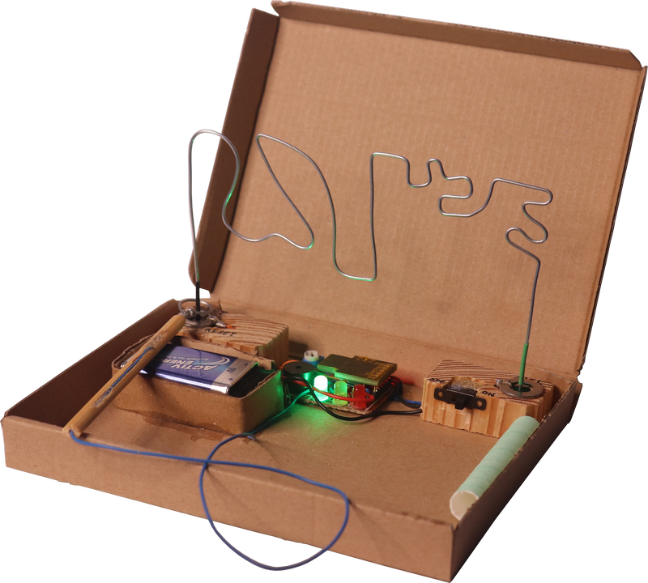
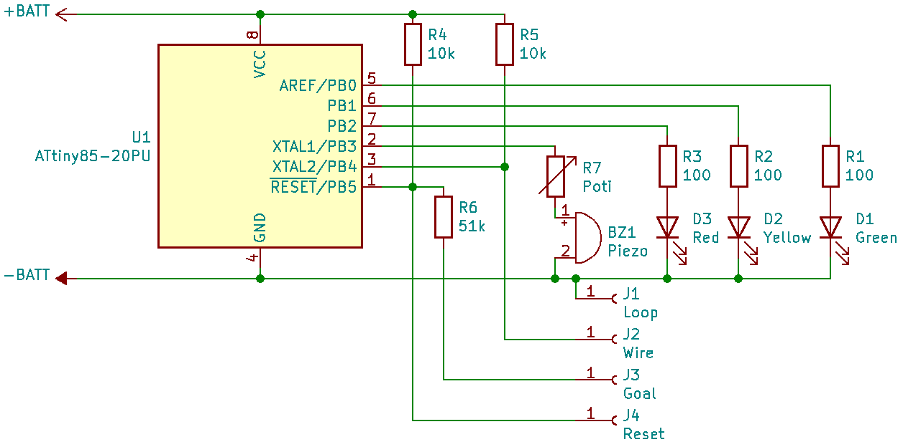

# ATtiny_Hot_Wire

The Hot wire game on an ATtiny85 with
- 3 LEDs
- Reset touch
- Goal touch (quirky)
- Wire 
- Sounds

## Usage

- The game (re-)starts when the ATtiny is powered or resetted
   - **ready**: green LED
- Move the loop along the wire without touching the wire
- When the loop touches the wire, a life is lost (warn sound)
   - **1st**: green + yellow LED
   - **2nd**: yellow LED
- When the wire is touched the third time, the game is lost and halts
   - **3rd**: red LED
- When the goal is touched with the loop, the game is won (plays melody)

## Wiring (schema)

- R1 to R3 are resistors to drive the LEDs
- R4 to R5 are pull-up resistors for the reset and wire pins
- R6 is a voltage divider resistor to allow using the reset pin twice (see below)
- R7 is a potentiometer to controll the sound volume
- D1 to D3 are colored LEDs to show the game status
- BZ1 is a passive piezo buzzer to play sound

When using a ATtiny85 chip direktly the battery voltage can be about 3.5V to 5V so you can use a li-ion battery directly if you use a lower clock than 16MHz. When using a Digispark board you can also use the included voltage regulator to use higher voltages on the VIN pin (e.g. a 9V block battery).

### Goal quirk

The ATtiny85 has 6 multi-function pins. The 6th pin is by default a reset pin though and although this behaviour can be disabled by changing a fuse, I want to use the pin as well to reset the chip and to check if the goal was reached. The reset is only triggered, when the voltage drops below a certain value. You can read the current voltage as an analog value and everything below about 600 triggers the reset. So, I use a pullup resistor of about 10k to keep the voltage up and then another about 51k resistor to pull the volate down when the goal is touched with the loop.
